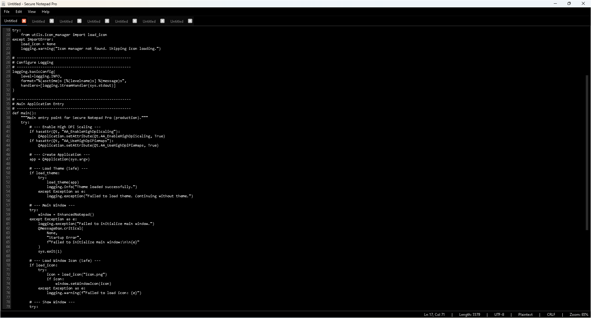
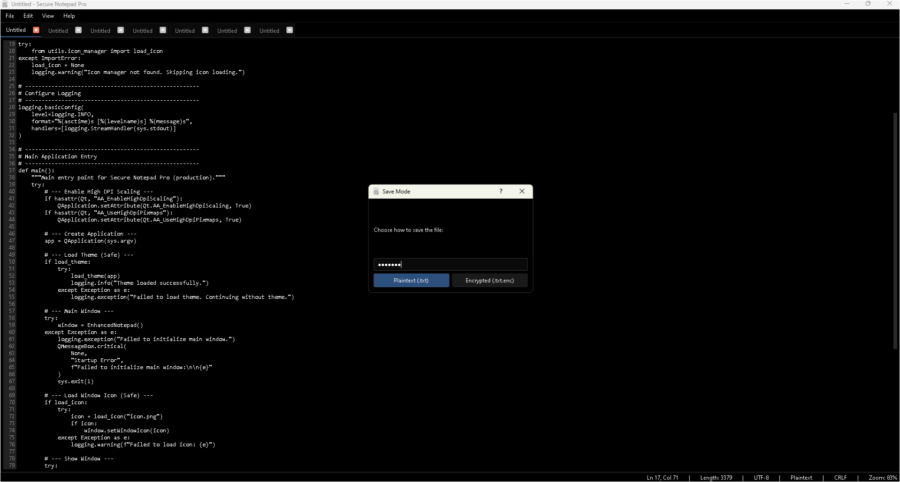
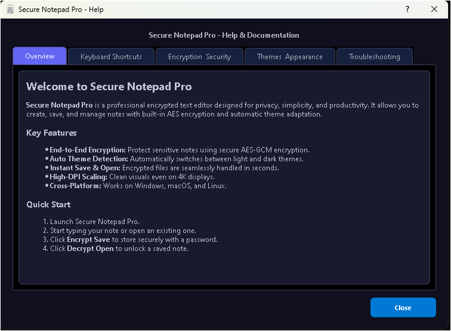
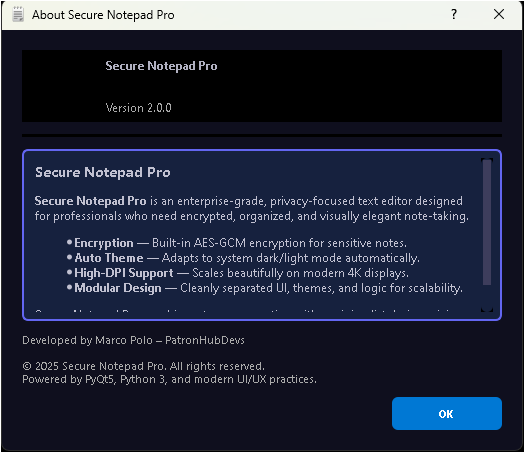
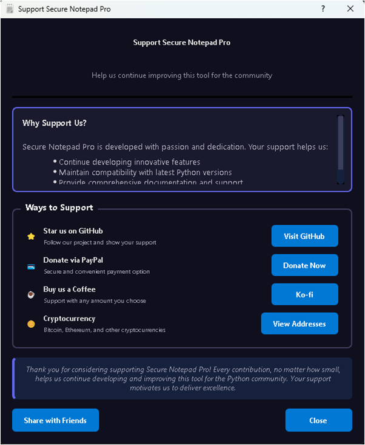
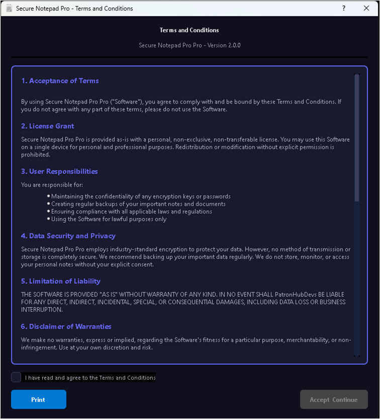
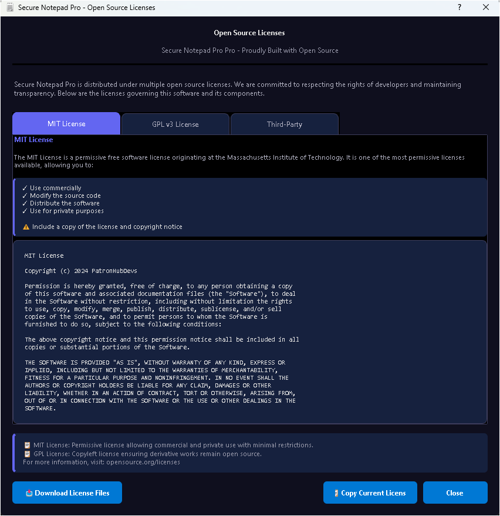

# Secured Notepad v2.0.0


A professional, modular, and feature-rich text editor built with Python and PyQt5. Enhanced Notepad supports line numbering, dark theme, zooming, and strong AES-256 encryption for sensitive notes.

---

## 📂 Project Structure

```
EnhancedNotepad/
├── assets/                  # Project assets like icons and logos
│   └── screenshots/                                # Screenshots for README
├── modules/                                        # Modular Python files
│   ├── editor.py                                   # EnhancedTextEditor with line numbers
│   ├── encryption_cpp.cp310-win_amd64.pyd          # Encryption/Decryption utilities
│   └── dialogs.py                                  # Custom dialogs (SaveModeDialog)
├── resources_rc.py                                 # Notepad main application
├── notepad.py                                      # Main application entry point
├── main.py                                      # Main application entry point
├── README.md                                       # This file
├── LICENSE                                         # MIT License
└── requirements.txt                                # Python dependencies
```

---

## ⚡ Features

### 🧠 Productivity
- **Line Numbers** for better navigation and coding.
- **Zoom Controls** with `Ctrl++`, `Ctrl+-`, and reset via `Ctrl+0`.
- **Status Bar Info:** Line, column, character count, zoom, encoding, and encryption state.

### 🎨 User Interface
- **Dark Theme (auto-detects system theme)** via `theme_manager.py`.
- **Icon Manager** ensures resource-based and local fallback loading.
- **High-DPI Scaling** for 4K and Retina displays.

### 🔒 Security
- **AES-256-GCM Encryption** for `.txt.enc` files.
- **HMAC-SHA256 Integrity Validation**.
- **Pure Python backend** (no `.pyd` dependencies).

### 🧩 Architecture
- **Fully Modular Codebase** for easy extension and maintenance.
- **Theme Fallback Handling** (QRC or local folder).
- **Cross-platform Compatibility** (Windows, Linux, macOS).
---

## 🖼 Screenshots

**Main Editor Window:**



**Encryption Dialog:**



**Help Dialog:**



**About Dialog:**



**Donate Dialog:**



**Terms and Conditions Dialog:**



**License Agreement Dialog:**


---

## 🚀 Installation

1. Clone the repository:

```bash
git clone https://github.com/j3fcruz/Secured-Notepad.git
cd Secured-Notepad
```

2. Create a virtual environment (recommended):

```bash
python -m venv venv
source venv/bin/activate  # Linux/Mac
venv\Scripts\activate     # Windows
```

3. Install dependencies:

```bash
pip install -r requirements.txt
```

4. Run the application:

```bash
python notepad.py
```

> **Note:** Encryption features require the `cryptography` library. If missing, only plaintext saving is available.

---

## 🏗 Build & Packaging

To generate a standalone Windows executable using PyInstaller:

1. Install PyInstaller

```bash
pip install pyinstaller
```
2. Build Command (Production Ready)

```bash
pyinstaller --onedir --noconsole --clean --uac-admin \
    --icon="assets/icons/icon.ico" \
    --name="Secure_Notepad_Pro" \
    --add-data "ui;ui" \
    --add-data "assets;assets" \
    --exclude-module PySide6 \
    notepad.py
```
Flags Explanation:

| Module               | Description                                        |
|----------------------|----------------------------------------------------|
| **--onedir**         | Creates a folder with executable + dependencies.ad |
| **--noconsole**      | Hides the console window (GUI only).               |
| **--clean**          | Removes previous build artifacts before buildin    |
| **--uac-admin**      | Requests admin privileges on Windows.              |
| **--icon**           | Application icon for the executable.            |
| **--name**           | Name of the generated executable.           
| **--add-data**       | Include additional folders (UI files, assets, etc.).           
| **--exclude-module** | Exclude conflicting Qt bindings (like PySide6).           

3. Output

After running the command, the executable will be in:

```bash    
dist/Secure_Notepad_Pro/
```
Run Secure_Notepad_Pro.exe directly from this folder.

4. Optional: .spec File

For repeated builds without typing the command:

1. Generate the initial .spec file:
```bash    
pyinstaller --onedir --noconsole --icon="assets/icons/icon.ico" notepad.py
```
2. Edit the .spec file to include additional data folders:
```bash    
a = Analysis(
    ['notepad.py'],
    pathex=[],
    binaries=[],
    datas=[('ui', 'ui'), ('assets', 'assets')],
    ...
)
```
3. Build using the .spec
```bash    
pyinstaller notepad.spec
```
---✅ This ensures all resources (.qrc, themes, icons, screenshots) are bundled automatically.


## 📝 Usage

1. **New File:** Ctrl+N
2. **Open File:** Ctrl+O
3. **Save File:** Ctrl+S
4. **Save As:** Ctrl+Shift+S (select plaintext or encrypted mode)
5. **Undo/Redo:** Ctrl+Z / Ctrl+Y
6. **Cut/Copy/Paste:** Ctrl+X / Ctrl+C / Ctrl+V
7. **Zoom In/Out:** Ctrl++ / Ctrl+-
8. **Restore Zoom:** Ctrl+0
9. **Toggle Status Bar:** View > Status Bar

**Encrypted File Workflow:**

1. Choose `Save As` and select `Encrypted (.txt.enc)`.
2. Enter a strong password.
3. Open `.txt.enc` file: enter the password to decrypt.

---

## ⚙ Dependencies

```text
PyQt5>=5.15.7
cryptography>=41.0.0  # Optional for encryption
```

Install via pip:

```bash
pip install -r requirements.txt
```

---

## 🛠 Contributing

1. Fork the repository.
2. Create a new branch: `git checkout -b feature/YourFeature`.
3. Make your changes.
4. Commit changes: `git commit -m 'Add YourFeature'`.
5. Push to branch: `git push origin feature/YourFeature`.
6. Create a Pull Request.

> All contributions must follow modular structure and code documentation.

---

## 📜 License

This project is licensed under the MIT License. See the [LICENSE](LICENSE) file for details.

---

## 👤 Author

**Marco Polo (PatronHub)**  
GitHub: [@j3fcruz](https://github.com/j3fcruz)  
Ko-fi: [@marcopolo55681](https://ko-fi.com/marcopolo55681)  
Website: [PatronHub Devs](https://patronhubdevs.online)

---


## 🔑 Notes

* Always backup your encrypted files and passwords.
* The application supports only UTF-8 encoded text files.
* Recommended for note-taking, coding, and personal documentation.

---

Ready to contribute, showcase, or fork for your own projects!

---
## 🧩 Version History

### [2.0.0] – 2025-11-06  
#### Major Release  

##### 🚀 New Features
- **Theme Manager:** Added `theme_manager.py` for automatic theme switching based on the system (dark/light mode detection).
- **Icon Manager:** Added `icon_manager.py` to centralize icon loading and resource fallback handling.
- **High-DPI Support:** Improved UI scaling for 4K and HiDPI displays.
- **Modular Architecture:** Moved main UI logic into `/ui` folder for better structure, maintainability, and clarity.

##### 🔐 Security & Backend
- Replaced compiled `.pyd` encryption backend with pure Python implementation for transparency, portability, and easier builds.

##### 🎨 UI & UX
- Enhanced dark theme styling and improved stylesheet handling with fallback to local asset folder if resource not found.
- Refined window icon handling for better cross-platform display consistency.

##### 🧩 Developer Experience
- Simplified imports and organized codebase for better readability.
- Prepared project for easier packaging with PyInstaller and GitHub releases.

##### 🔍 Zoom Controls
- Improved zoom functionality with smoother scaling and better status bar updates.

---

### [1.0.0] – 2025-10-28  
#### Initial Release
- First stable version of Enhanced Notepad.  
- Basic text editing, file open/save, and dark theme support.
