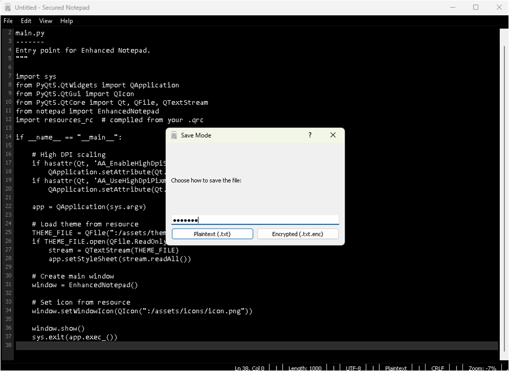

# Secured Notepad

 

A professional, modular, and feature-rich text editor built with Python and PyQt5. Enhanced Notepad supports line numbering, dark theme, zooming, and strong AES-256 encryption for sensitive notes.

---

## 📂 Project Structure

```
EnhancedNotepad/
├── assets/                  # Project assets like icons and logos
│   └── screenshots/                                # Screenshots for README
├── modules/                                        # Modular Python files
│   ├── editor.py                                   # EnhancedTextEditor with line numbers
│   ├── encryption_cpp.cp310-win_amd64.pyd          # Encryption/Decryption utilities
│   └── dialogs.py                                  # Custom dialogs (SaveModeDialog)
├── resources_rc.py                                 # Notepad main application
├── notepad.py                                      # Main application entry point
├── main.py                                      # Main application entry point
├── README.md                                       # This file
├── LICENSE                                         # MIT License
└── requirements.txt                                # Python dependencies
```

---

## ⚡ Features

* **Dark Theme**: Professionally designed dark UI.
* **Line Numbers**: Always visible for coding or note-taking.
* **Encryption**: AES-256-GCM with HMAC-SHA256 fallback encryption for sensitive notes (.txt.enc).
* **Zoom Control**: Zoom in/out and restore default font size.
* **Status Bar**: Displays line/column, character count, zoom, encoding, and encryption status.
* **Menu Integration**: Full File, Edit, and View menus with keyboard shortcuts.
* **Modular Code**: Clean separation for easier maintenance and contribution.

---

## 🖼 Screenshots

**Main Editor Window:**


**Encryption Dialog:**



---

## 🚀 Installation

1. Clone the repository:

```bash
git clone https://github.com/j3fcruz/Secured-Notepad.git
cd Secured-Notepad
```

2. Create a virtual environment (recommended):

```bash
python -m venv venv
source venv/bin/activate  # Linux/Mac
venv\Scripts\activate     # Windows
```

3. Install dependencies:

```bash
pip install -r requirements.txt
```

4. Run the application:

```bash
python notepad.py
```

> **Note:** Encryption features require the `cryptography` library. If missing, only plaintext saving is available.

---

## 📝 Usage

1. **New File:** Ctrl+N
2. **Open File:** Ctrl+O
3. **Save File:** Ctrl+S
4. **Save As:** Ctrl+Shift+S (select plaintext or encrypted mode)
5. **Undo/Redo:** Ctrl+Z / Ctrl+Y
6. **Cut/Copy/Paste:** Ctrl+X / Ctrl+C / Ctrl+V
7. **Zoom In/Out:** Ctrl++ / Ctrl+-
8. **Restore Zoom:** Ctrl+0
9. **Toggle Status Bar:** View > Status Bar

**Encrypted File Workflow:**

1. Choose `Save As` and select `Encrypted (.txt.enc)`.
2. Enter a strong password.
3. Open `.txt.enc` file: enter the password to decrypt.

---

## ⚙ Dependencies

```text
PyQt5>=5.15.7
cryptography>=41.0.0  # Optional for encryption
```

Install via pip:

```bash
pip install -r requirements.txt
```

---

## 🛠 Contributing

1. Fork the repository.
2. Create a new branch: `git checkout -b feature/YourFeature`.
3. Make your changes.
4. Commit changes: `git commit -m 'Add YourFeature'`.
5. Push to branch: `git push origin feature/YourFeature`.
6. Create a Pull Request.

> All contributions must follow modular structure and code documentation.

---

## 📜 License

This project is licensed under the MIT License. See the [LICENSE](LICENSE) file for details.

---

## 👤 Author

**Your Name**
GitHub: [@j3fcruz](https://github.com/j3fcruz)
Ko-fi: [@marcopolo55681](https://ko-fi.com/marcopolo55681)

---

## 🔑 Notes

* Always backup your encrypted files and passwords.
* The application supports only UTF-8 encoded text files.
* Recommended for note-taking, coding, and personal documentation.

---

Ready to contribute, showcase, or fork for your own projects!

